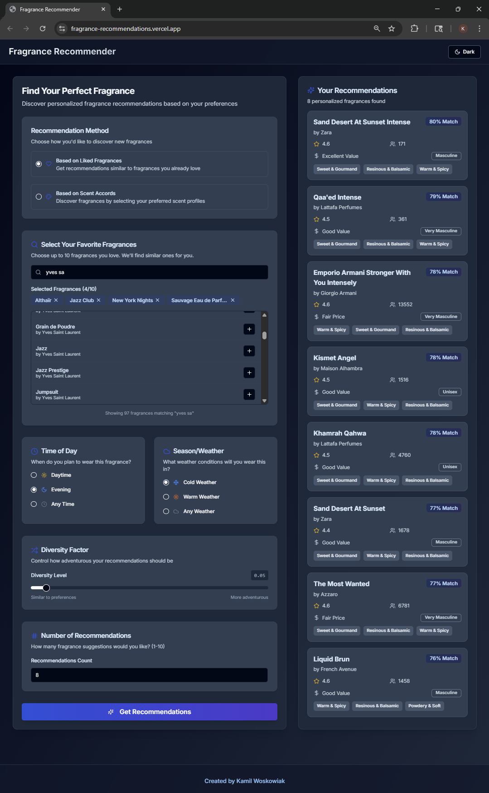
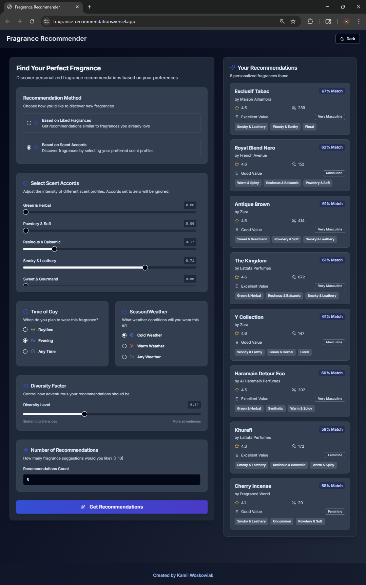

# Fragrance Recommendations

A production-ready **serverless recommendation system** that helps fragrance enthusiasts discover new perfumes they are statistically likely to enjoy *and* encourages exploration beyond their current collection.  
The solution combines high-throughput web scraping, rigorous feature-engineering, and a hybrid relevance/diversity ranking engine behind a FastAPI micro-service deployed to AWS Lambda.

---

## Key Points

| Domain | Highlights |
| --- | --- |
| **Data Engineering** | - Multi-threaded crawler (> 5× speed-up) pulling ~20 k perfumes from *fragrantica.com*.<br>- Accord and note taxonomy collapsed to 11 high-level groups for better generalisation.<br>- TF-IDF weighting surfaces under-represented notes. |
| **Machine Learning** | - Vectorisation of every fragrance on *≈ 45* numeric features (accord strengths + gender/price/time/season scores).<br>- Cosine similarity + Bayesian-smoothed ratings for relevance.<br>- **MMR** re-ranking for controllable diversity. |
| **Software Engineering** | - Typed FastAPI backend (Pydantic v2) packaged as a Docker image and shipped to AWS Lambda + API Gateway.<br>- GitHub Actions CI: PyTest → Docker build → push to Amazon ECR → `lambda update-function-code`. |
| **Frontend** | - Lightweight Next.js / Tailwind dashboard. |

---

## Screenshots & Demo

  


<https://github.com/user-attachments/assets/0f0d33c4-4d6c-4c92-9aae-0a63e2ee3495>

---

## 1  Project Motivation

Buying a new perfume is tricky: you want something that **fits your taste** yet isn’t a carbon-copy of what you already own.  
This engine models your olfactory preferences from either:

1. **Fragrances you already like**, or  
2. A manual slider-based profile of **accord intensities**,

then returns a shortlist that balances **similarity** and **novelty** via a tunable `diversity_factor`.

---

## 2  Data Collection & Preparation

### 2.1 Source & Scraper

- **Site**: [Fragrantica](https://www.fragrantica.com)  
- **Orchestration**: `multithreadedGatheringData.py` spins up a producer–consumer *ThreadPool* (configurable `N_WORKERS`) that:  
  1. Fetches HTML pages through a proxy.  
  2. Parses with *BeautifulSoup*.  
  3. Serialises raw rows to CSV (one file per worker) to avoid locking.

This parallelism brings the crawl time for ~20 k pages down to **≈ 2 hours**, compared with ≈ 20 h single-threaded.

### 2.2 Normalisation & Feature Engineering

| Dimension | Technique |
| --- | --- |
| **Accords** | Collapsed to 11 macro groups (e.g. *Woody & Earthy*, *Citrus & Fresh*) to reduce sparsity and improve interpretability. |
| **Votes → Scores** | Generic helper: |

```python
def compute_weighted_score(vote_dict: dict[str, int], mapping: dict[str, int]) -> float:
    ...
````

* **`gender_score`** — scale **–2 ↔ +2**
* **`priceValue_score`** — same scale
* **Note matrix** → **TF-IDF** → re-scaled accord columns so that rare notes punch above frequency-based averages

The processed dataset is persisted as `RecommendationEngine/data/fragrances_processed.csv`.

---

## 3  Recommendation Algorithm

### 3.1 Vector Space

Every perfume is represented by:

* Accords
* `gender_score`
* `priceValue_score`
* `timeOfDay_score`
* `season_score`
* `ratingValue`

The user profile **u** is either:

* The mean vector of liked fragrances, or
* A synthetic vector built from accord sliders.

### 3.2 Relevance Score

1. **Similarity**

$$
\text{sim}(i)=\frac{\mathbf{u}\cdot \mathbf{x}_i}{\lVert \mathbf{u}\rVert\,\lVert \mathbf{x}_i\rVert}
$$

2. **Quality signals**

* **Bayesian rating**:
  \$\text{rating\_score} = \dfrac{v n + m C}{n + C}\$ with *m = 3*, *C = 10*.
* **Context match** (`time`, `season`) – linear 0–1 transform.
* **Price value** – normalised.

3. **Base score**

$$
\text{final} = w_{sim} \cdot \text{sim} + 0.20 \cdot \text{rating} + 0.15 \cdot \text{price} + 0.15 \cdot \text{time} + 0.15 \cdot \text{season}
$$

where

$$
w_{sim} = 0.35 \bigl(1 - \text{diversity}\bigr)
$$

### 3.3 Diversity-Aware Re-Ranking (MMR)

**Maximal Marginal Relevance (MMR)** is a greedy re-ranking step that balances *relevance* to the user with *diversity* among the items you return.
Starting from an empty `selected` list, the algorithm repeatedly chooses the perfume *i* that maximises

$$
\text{MMR}(i)=\lambda\,R_i \;-\; (1-\lambda)\,\max_{j\in\text{selected}}\bigl[\text{sim}(V_i,V_j)\bigr]
$$

where `R_i` is the pre-computed base-score and $\text{sim}(V_i,V_j)$ is the cosine similarity between the candidate’s feature vector and each already-selected vector. The first term rewards high-relevance items; the second subtracts a penalty if *i* is too similar to what’s already in the list.

The trade-off is governed by **λ ∈ \[0, 1]**:

* **λ = 1** → ignore diversity and output the top-scoring perfumes only.
* **λ = 0** → ignore base scores and greedily spread the results across the vector space.
* Intermediate values (e.g., λ = 0.7) yield a mix: the higher λ is, the more weight the recommender gives to relevance; the lower it is, the more it favours novelty.

Because each newly selected item influences the penalty term going forward, the list naturally becomes more varied while still honouring user preferences to the degree set by λ.


### 3.4 Output Annotations

* **`gender_label`**: bucketed score → “Feminine / Unisex / Masculine”
* **`price_value_label`**: “Very Overpriced / Fair Price / Great Value”
* **`dominant_accords`**: top accords > 30 %

---

## 4  Backend Service

| Layer   | Tech                                                                                                              | Notes                                                                                                          |
| ------- | ----------------------------------------------------------------------------------------------------------------- | -------------------------------------------------------------------------------------------------------------- |
| API     | **FastAPI 1.4**                                                                                                   | Typed with **Pydantic v2** models.                                                                             |
| Model   | `FragranceRecommender`                                                                                            | Pure-Python, uses **scikit-learn** (`cosine_similarity`) but **no heavyweight training** → instant cold-start. |
| Hosting | **AWS Lambda** (Python 3.12 image) behind API Gateway; cold-start < 400 ms after packaging with all dependencies. |                                                                                                                |

### 4.1 Routes

| Method | Path                       | Request model                      | Purpose                             |
| ------ | -------------------------- | ---------------------------------- | ----------------------------------- |
| `GET`  | `/`                        | –                                  | Health probe                        |
| `GET`  | `/list-fragrances`         | –                                  | Returns all `(brand, name)` tuples  |
| `GET`  | `/list-accords`            | –                                  | Returns master accord list          |
| `POST` | `/recommend-by-fragrances` | `RecommendationRequest`            | Recommend based on liked fragrances |
| `POST` | `/recommend-by-accords`    | `AccordBasedRecommendationRequest` | Recommend from accord sliders       |

Both POST routes accept `diversity_factor ∈ [0, 1]` and `top_k ≤ 20`.

---

## 5  CI / CD

* **Unit tests**: PyTest runs on GitHub Actions.
* **Docker**: `RecommendationEngine/Dockerfile` builds a slim Lambda image.
* **Pipeline** (`.github/workflows/main.yml`):

  1. Checkout & test.
  2. Build & push to **Amazon ECR** (tagged `latest` and commit SHA).
  3. `aws lambda update-function-code` with the new image — zero-downtime.

---

## 6  Running Locally

### 6.1 Backend

```bash
git clone https://github.com/KamilWoskowiak/Fragrance-Recommendations.git
cd Fragrance-Recommendations/RecommendationEngine

python -m venv .venv
source .venv/bin/activate        # Windows: .venv\Scripts\activate
pip install -r requirements.txt

# Dev server
uvicorn app.main:app --reload --port 8000
```

### 6.2 Frontend

```bash
cd ../Frontend
cp .env.example .env.local       # or create manually
# NEXT_PUBLIC_API_BASE_URL=http://localhost:8000   # leave blank to fallback to localhost
pnpm install
pnpm dev
```

Open [http://localhost:3000](http://localhost:3000).

---

## 7  Repository Layout

```text
├── DataCollectionProcessing/
│   ├── collectionScripts/        # multi-threaded crawler
│   │   ├── multithreadedGatheringData.py
│   │   ├── collectPageData.py
│   │   └── collectListDataByBrand.py
│   ├── csvData/                  # raw HTML → CSV dumps
│   └── dataProcessing/
│       └── DataProcessing.ipynb  # cleaning, TF-IDF, feature engineering
│
├── RecommendationEngine/
│   ├── app/
│   │   ├── api/controller.py     # route handlers
│   │   ├── model/schemas.py      # Pydantic DTOs
│   │   ├── service/recommender.py# core logic
│   │   └── main.py               # FastAPI + Mangum adapter
│   ├── data/fragrances_processed.csv
│   ├── tests/                    # PyTest suites
│   ├── Dockerfile
│   └── requirements.txt
│
├── Frontend/                     # Next.js 14 / App Router
│   └── …                         # UI components, pages, hooks
└── Docs/                         # Media for README
    ├── SelectByFragrance.png
    ├── SelectByAccords.png
    └── DemoVideo.mp4
```
